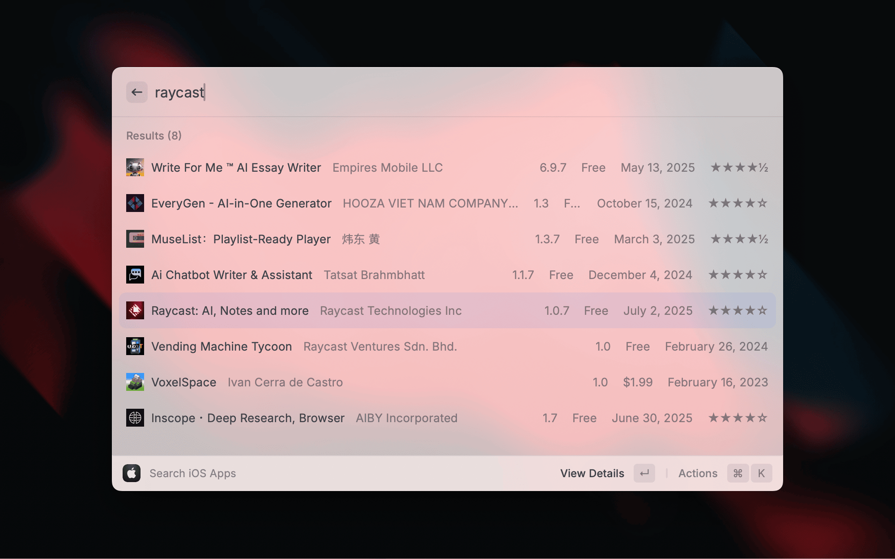

<div align="center">

# iOS Apps

[](LICENSE)
[](https://github.com/chrismessina)
[](https://github.com/chrismessina/raycast-ios-apps/stargazers)

**Search, inspect, and download iOS apps from the App Store — without leaving Raycast.**

[Features](#features) • [Requirements](#requirements) • [Quick Start](#quick-start) • [Usage](#usage) • [How It Works](#how-it-works) • [Privacy](#privacy) • [Development](#development)

</div>

---

## Features

- **Search by anything that identifies an app** — name, developer, bundle ID, App Store URL, or numeric app ID. Pasting a URL or ID finds brand-new apps that Apple's term index has not picked up yet
- **Rich app details** — ratings, screenshots, descriptions, release and version history, developer info
- **Filter search by platform** — iPhone, iPad, Mac, or Apple TV, remembered between launches
- **Developer's catalogue** — browse every app by one developer inside Raycast, without opening the App Store
- **Purchased apps** — everything this Apple ID has ever acquired, newest first, sortable by purchase date or name. Finds apps the Store search can't, including titles that have since been delisted
- **Download IPAs** — pulled through `ipatool` and renamed to `{App Name} {Version}.ipa`
- **Full-resolution screenshots** — extracted per platform (iPhone, iPad, Mac, Apple TV, Apple Watch, Vision Pro) and filtered by your preferences
- **Favorites** — star apps for quick access; export the list to Markdown or CSV
- **Download history** — every download tracked with a count and timestamp, sortable and filterable, capped at the 100 most recent
- **Recent searches** — queries saved automatically and re-runnable in one keystroke
- **Five Raycast AI tools** — search, details, current version, download, and screenshot download, all callable as `@ios-apps`

---

## Requirements

- [Raycast](https://www.raycast.com/) installed
- macOS — `ipatool` and the Keychain integration are macOS-only
- [Homebrew](https://brew.sh) and [`ipatool`](https://github.com/majd/ipatool) **2.5.0 or greater**, for downloads. Anything older hits Apple's commerce auth gate — the HTTP 403 "empty or non-plist body" failure ([majd/ipatool#522](https://github.com/majd/ipatool/issues/522), [#523](https://github.com/majd/ipatool/issues/523)) fixed in 2.4.0 by SAP-signed App Store requests. 2.5.0 adds `list-purchases`, visionOS search/download, and transient-auth retry. The floor is enforced in `/Users/messina/Developer/GitHub/chrismessina/raycast-ios-apps/src/utils/ipatool-validator.ts`.

```bash
# Homebrew, if you don't have it
/bin/bash -c "$(curl -fsSL https://raw.githubusercontent.com/Homebrew/install/HEAD/install.sh)"

# ipatool — uninstall first if you already have an older build
brew uninstall ipatool
brew install ipatool
```

**Searching and viewing details need neither `ipatool` nor an Apple ID.** Only downloading does.

`ipatool` is auto-detected in the usual places — `/opt/homebrew/bin` (Apple Silicon), `/usr/local/bin` (Intel), `/usr/bin`, `~/.local/bin`, `~/bin`, and anything on your `PATH`. Set **ipatool Path** in preferences if yours lives elsewhere.

---

## Quick Start

1. Open Raycast and search for **"Search iOS Apps"**
2. Type an app name — or paste an App Store URL, bundle ID, or numeric app ID
3. Select an app to see full details, screenshots, and version history
4. To download, sign in with your Apple ID when prompted — the login and two-factor forms both run inside Raycast



---

## Usage

### Commands

| Command             | Mode      | Description                                                                      |
| ------------------- | --------- | -------------------------------------------------------------------------------- |
| Search iOS Apps     | `view`    | Search the App Store; recent searches are tracked automatically                  |
| View Purchased Apps | `view`    | Everything this Apple ID owns, paged as you scroll and sortable by purchase date |
| View Favorites      | `view`    | Manage starred apps and export them to Markdown or CSV                           |
| Download History    | `view`    | Browse past downloads with sorting, filtering, and re-download                   |
| Logout              | `no-view` | Revoke `ipatool` auth and clear stored credentials                               |

**On View Purchased Apps:** `ipatool list-purchases` costs roughly six seconds per request regardless of page size — that is per-request overhead on Apple's side, not per-app — so the first page takes a moment and later visits open from cache. Pages load as you scroll. Sorting by **purchase date** is done by Apple and covers the whole library; sorting by **name** can only reorder the rows already loaded, and the section header says how many that is. No price is shown: the purchase records report `0` for every app, so what you actually paid is not recoverable.

### Raycast AI Tools

| Tool                         | Example                                              |
| ---------------------------- | ---------------------------------------------------- |
| Search iOS Apps              | `Search @ios-apps Spotify`                           |
| Get iOS App Details          | `Get @ios-apps details for "Airbnb"`                 |
| Get iOS App Version          | `Get @ios-apps What's the latest version of Airbnb?` |
| Download iOS App             | `Download @ios-apps "Instagram"`                     |
| Download iOS App Screenshots | `Download @ios-apps screenshots for "Instagram"`     |

Search accepts an optional `limit` (default 10, max 20). **The AI tools search via `ipatool`, so they require authentication** — unlike the Search command, which uses the iTunes API and does not.

### Favorites, History, and Recent Searches

- **Favorites** — star from search results or detail view; stored via Raycast's storage API; export to Markdown or CSV
- **Download History** — automatic per-download tracking with a counter; sort by recency, download count, or name; search by name, developer, or bundle ID; re-download or remove entries; keeps the last 100
- **Recent Searches** — saved automatically, surfaced when the search command opens, individually removable

### Preferences

| Preference               | Values                                               | Default                     |
| ------------------------ | ---------------------------------------------------- | --------------------------- |
| Download Path            | directory                                            | `~/Downloads`               |
| Homebrew Path            | path                                                 | `/opt/homebrew/bin/brew`    |
| ipatool Path             | path                                                 | `/opt/homebrew/bin/ipatool` |
| Include Screenshots From | iPhone, iPad, Mac, Apple TV, Apple Watch, Vision Pro | iPhone + iPad               |
| Download Timeout         | seconds (min 30)                                     | `90`                        |
| Max Concurrent Downloads | 1–10                                                 | `5`                         |
| Max Stall Timeout        | milliseconds                                         | `30000`                     |
| Cleanup Temporary Files  | on / off                                             | on                          |
| Integrity Verification   | Basic, Checksum, Off                                 | Basic                       |
| Debug Logging            | on / off                                             | off                         |

**On concurrency:** higher is faster but heavier; 3–7 suits most machines. **On platform filters:** screenshots are always _extracted_ for every platform Apple publishes — the preference controls only which are _downloaded and saved_, so disabling one saves time and disk, not fidelity.

---

## How It Works

### Two sources, two jobs

1. **iTunes API** — powers the Search command and all metadata: high-resolution icons and screenshots, ratings, descriptions, release dates, version history, developer info. No Apple ID required.
2. **`ipatool`** — handles App Store authentication and IPA downloads, and backs the search used by the AI tools.

Apple's term-search index lags the App Store by hours to days, so a just-released app can be missing from a name search while still resolving by ID. Pasting an App Store URL (`https://apps.apple.com/us/app/.../id6761221765`), a bare numeric ID, or a bundle ID routes to Apple's exact-lookup endpoint instead. A bundle ID or bare number that finds nothing falls back to a normal name search.

### Screenshot extraction

Full-resolution screenshots are parsed out of the "shoebox" JSON Apple embeds in App Store web pages — `<script type="fastboot/shoebox" id="shoebox-media-api-cache-apps">`. The payload is nested JSON-inside-JSON, so extraction parses the outer object, then the inner strings, then walks to:

```typescript
d[0].attributes.platformAttributes[platform].customAttributes.default.default.customScreenshotsByType
```

Apple's internal device identifiers are mapped to platforms (`iphone_6_5`/`iphone_d74` → iPhone, `ipadpro_2018`/`ipad_pro_129` → iPad, `appletv` → Apple TV, `applewatch_2022` → Apple Watch, `applevision`/`visionpro` → Vision Pro, `mac`/`macbook` → Mac), and URLs are rewritten to the highest available resolution.

> ⚠️ **This is scraping, and Apple can change it without notice.** The parser checks both platform-specific and fallback paths, isolates JSON errors so one bad branch doesn't abort the run, returns partial results rather than nothing, and logs enough to diagnose a structure change. It is built to degrade rather than break — but a future App Store redesign could still affect screenshot extraction.

---

## Privacy

This extension does not collect or transmit personal data. It talks only to Apple, via the `ipatool` CLI and the iTunes API.

**The extension does store some credentials — here is exactly what, and where:**

| What                | Where                                                   | Notes                                                                                        |
| ------------------- | ------------------------------------------------------- | -------------------------------------------------------------------------------------------- |
| Apple ID            | Raycast `LocalStorage`, key `appleId`                   | Not encrypted. It is an identifier, not a secret.                                            |
| Password            | Raycast Keychain API, service `ios-apps-apple-password` | Only if that API is available; otherwise the extension logs a warning and does not store it. |
| Two-factor codes    | Nowhere                                                 | Never persisted.                                                                             |
| `ipatool`'s session | System Keychain, item `ipatool-auth.service`            | Created and owned by `ipatool` — this extension neither creates nor modifies it.             |

Nothing is collected or transmitted anywhere; the only network destination is Apple. The **Logout** command attempts `ipatool auth revoke`, then clears the stored Apple ID and deletes the password entry — and clears them even if the revoke fails.

Two-factor is fully supported, and both the login and 2FA forms run inside Raycast. You are prompted only when you first download something; after that, re-authentication should be rare.

### Reducing repeated Keychain prompts

The Keychain item governing `ipatool`'s session is created and owned by `ipatool` (usually `ipatool-auth.service`) — **this extension neither creates nor modifies it.** macOS may prompt when Raycast or `ipatool` accesses it. To reduce prompts:

1. Open **Keychain Access** and search for `ipatool-auth.service`
2. Double-click the item → **Access Control** tab
3. Keep _Confirm before allowing access_, and add the real `ipatool` binary under _Always allow access by these applications_:
   - Apple Silicon: `/opt/homebrew/bin/ipatool` → right-click → **Show Original** and add the binary under `/opt/homebrew/Cellar/ipatool/<version>/bin/ipatool` (add the original, not the symlink)
   - Intel: the equivalent under `/usr/local/Cellar/ipatool/<version>/bin/ipatool`
   - Add `Raycast.app` too if prompts persist
4. **Save Changes**

_Allow all applications to access this item_ also works and is **not recommended.**

The extension may store your Apple ID password in a separate Keychain entry, `ios-apps-apple-password`. It is independent of `ipatool`'s item and does not alter its ACL. There is no programmatic way to set a Keychain ACL — macOS owns that, by design.

---

## Troubleshooting

| Symptom                                             | Cause and fix                                                                                                                                    |
| --------------------------------------------------- | ------------------------------------------------------------------------------------------------------------------------------------------------ |
| Search returns nothing for an app you know exists   | The app is too new for Apple's term index. Paste its App Store URL or numeric app ID instead — that path uses exact lookup                       |
| Authentication failures                             | Run `ipatool auth login` directly in a terminal to see the real error                                                                            |
| Download errors                                     | Check free disk space and write permission on your download directory                                                                            |
| AI tool search fails while the Search command works | The AI tools go through `ipatool`, which must be installed, on the configured path, **and authenticated**. The Search command needs none of that |

---

## Development

### Project Structure

```bash
raycast-ios-apps/
├── src/
│   ├── search.tsx            # Search command
│   ├── favorites.tsx         # Favorites command
│   ├── download-history.tsx  # History command
│   ├── logout.ts             # Logout (no-view)
│   ├── ipatool.ts            # ipatool CLI wrapper — auth, download
│   ├── tools/                # Five Raycast AI tools
│   ├── hooks/                # Search, download, favorites, history state
│   ├── components/           # List items, detail view, action panels, auth forms
│   └── utils/                # App Store scraper, auth, progress
├── assets/                   # Extension icon
├── metadata/                 # Store screenshots
└── package.json
```

### Scripts

| Script             | Description                               |
| ------------------ | ----------------------------------------- |
| `npm run dev`      | Start in development mode with hot reload |
| `npm run build`    | Build for production                      |
| `npm run lint`     | Run Raycast ESLint config                 |
| `npm run fix-lint` | Auto-fix lint issues                      |
| `npm run publish`  | Publish to the Raycast Store              |

### Clone & Run

```bash
git clone https://github.com/chrismessina/raycast-ios-apps.git
cd raycast-ios-apps
npm install
npm run dev
```

---

## Tech Stack

| Package                        | Role                                                             |
| ------------------------------ | ---------------------------------------------------------------- |
| `@raycast/api`                 | Raycast extension primitives (List, Detail, ActionPanel, Form)   |
| `@raycast/utils`               | Higher-level Raycast utilities                                   |
| `@chrismessina/raycast-logger` | Structured logging for the App Store and `ipatool` request paths |
| `p-limit`                      | Bounds concurrent screenshot downloads to the configured maximum |
| `lodash`                       | Collection and string helpers                                    |

---

## Credits

- [`ipatool`](https://github.com/majd/ipatool) by Majd Alfhaily
- [iTunes Search API](https://developer.apple.com/library/archive/documentation/AudioVideo/Conceptual/iTuneSearchAPI/index.html) by Apple

---

MIT © [Chris Messina](https://github.com/chrismessina)
